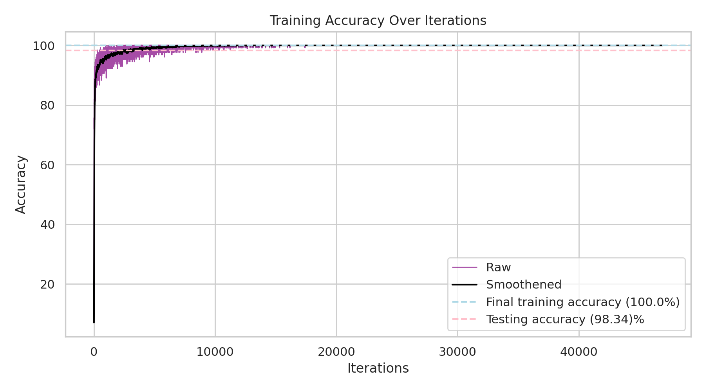
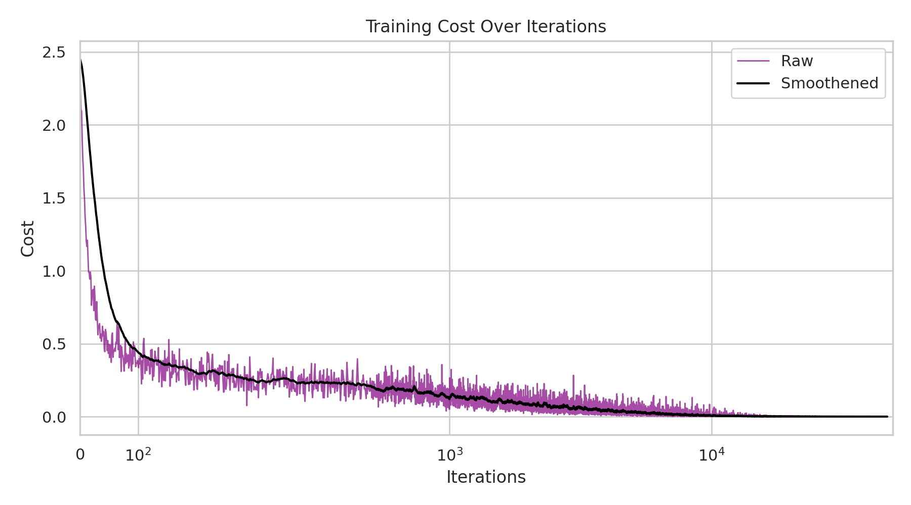
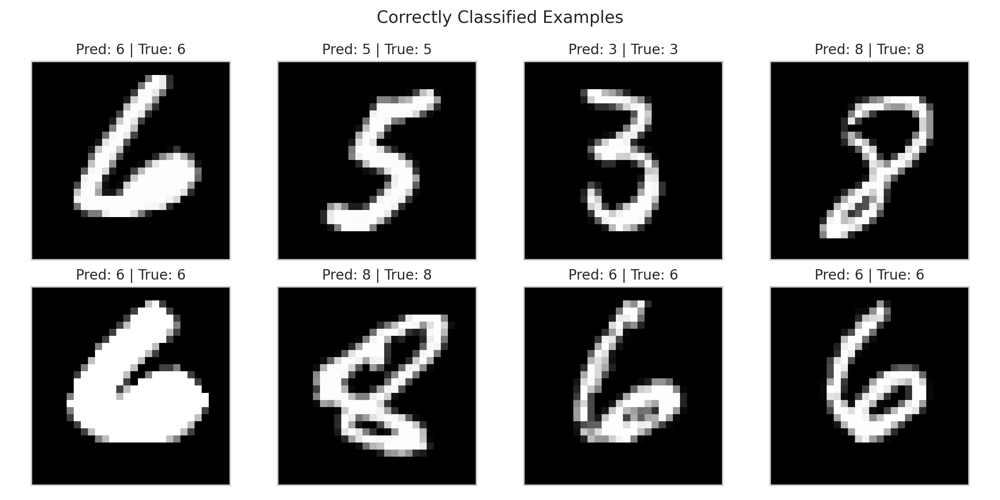
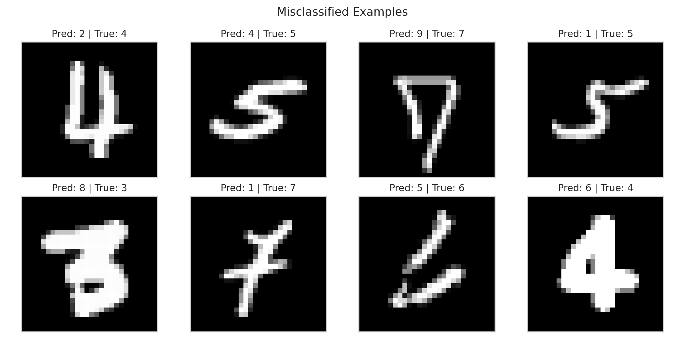

# 🕸️ Neural Network from Scratch (NumPy)

A from scratch fully connected neural network to classify the MNIST dataset
programmed in python. This project purposefully avoids ML frameworks and focuses
on understanding the underlying principles of how neural networks work by using
only NumPy.

## Quick Start

```bash
# clone this repo
git clone https://github.com/nick-ob/mnist-numpy-nn
cd mnist-numpy-nn

# install needed requirements
pip install -r requirements.txt

# fetch the MNIST data
python data/loader.py

# run the main entrypoint file
python main.py
```

## Usage

```python
from src.loading import load_mnist
from src.model import Network
from src.visualisations import save_cost, save_accuracy, save_confusion_matrix, save_classified

# loading MNIST data
(x_train, y_train), (x_test, y_test) = load_mnist()

# creating a network with the desired architecture
network = Network(784, 128, 64, 10)
# or load a saved network:
network, history = Network.load("readme")

# train the network
history = network.train((x_train, y_train), 0.01, 10, batch_size=256)

# test the network
pred, act, acc = network.test((x_test, y_test))

# saving the network and performance plots
name: str = "any-name"
# network saving
network.save(name)
# plot saving
save_cost(history["cost"], name)
save_accuracy(history["accuracy"], acc, name)
save_confusion_matrix(pred, act, name)
save_classified(x_test, pred, act, name)
```

## What This Project Includes

- Custom fully connected neural network implementation in pure NumPy
- Modular code structure
- MNIST raw data download + parsing pipeline
- Training + testing workflow
- Saved model parameters (.npz)
- Visualizations for:
  - Cost over Iterations
  - Accuracy over Iterations
  - Confusion matrix
  - Correctly classified vs misclassified examples

## Results

<details>
<summary><b>Hyperparameters & Configuration</b></summary>

Current and used settings (in `main.py`):

```bash
Network(784, 512, 512, 10)  # Architecture
train(..., lr=0.1, epochs=100, batch_size=128)
```

**Why these values?**

- `lr=0.1`: Fast convergence without overshooting
- `batch_size=128`: Good balance between stability and speed
- `512→512`: Enough capacity without overfitting on MNIST

To experiment: Adjust any hyperparameters in `main.py`, set the `name`
variable to save under, then rerun. The results are saved in [`results/`](results/)
under the set `name` variable.
</details>

### Accuracy over Iterations



The model’s accuracy improves steadily during training and begins to plateau,
indicating stable learning.

### Confusion Matrix


The majority of digits are classified correctly. Misclassifications tend to occur
between visually similar digits (e.g. between 4 & 9), which makes sense since they
are of similar shapes.

### Training Loss



The training loss decreases consistently over time, confirming that the model
is effectively learning through gradient-based optimization.

### Correctly Classified vs Misclassified Examples




## Project Structure

```text
mnist-numpy-nn/
|-- main.py
|-- requirements.txt
|-- data/
|   |-- loader.py              # downloads MNIST .gz files
|   |-- mnist/                 # raw MNIST files
|   |-- networks/              # saved models
|-- src/
|   |-- loading.py             # loads and preprocesses MNIST
|   |-- model.py               # Network class: train/test/save/load
|   |-- layer.py               # layer implementation
|   |-- activations.py         # ReLU / Sigmoid / Softmax
|   |-- loss.py                # CCE loss + accuracy metric
|   |-- visualisations.py      # plots + result image exports
|-- results/
|   |-- readme/                # plots are saved here under the name
|   |...                       # variable (see Hyperparameters section)
|-- notebooks/
    |-- main.ipynb
```

## Tech Stack

- **Python**
- **NumPy** - math
- **Matplotlib, Seaborn** - visualisations

## License

MIT — See [LICENSE](LICENSE)
