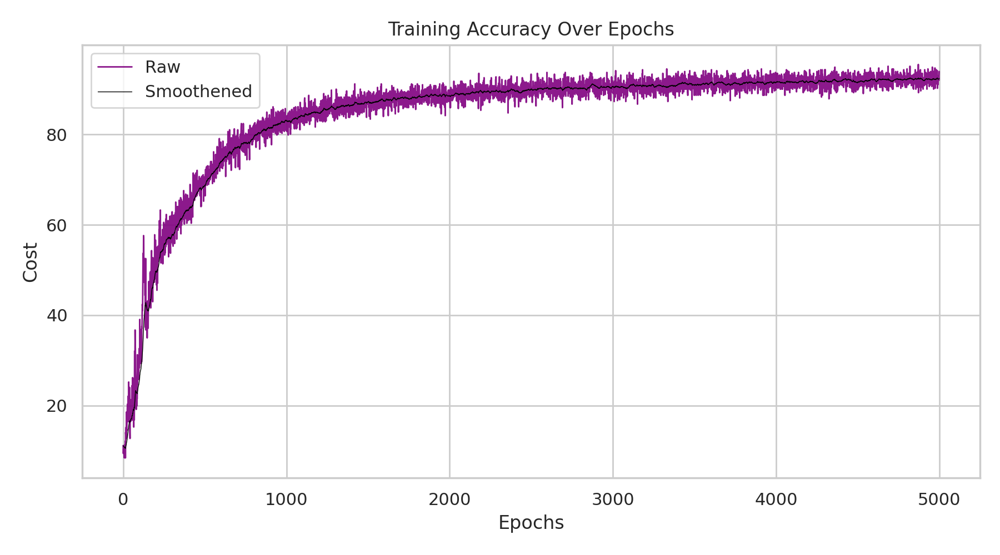
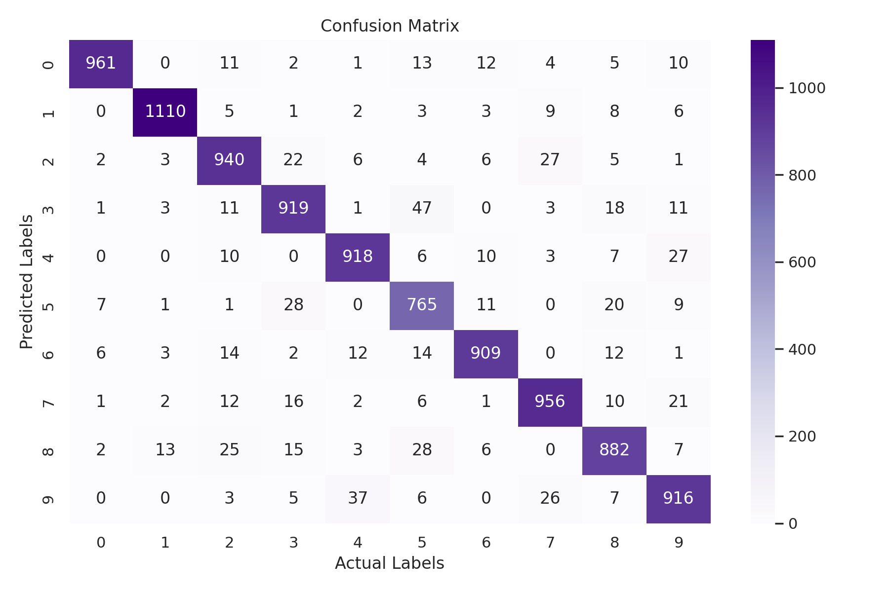
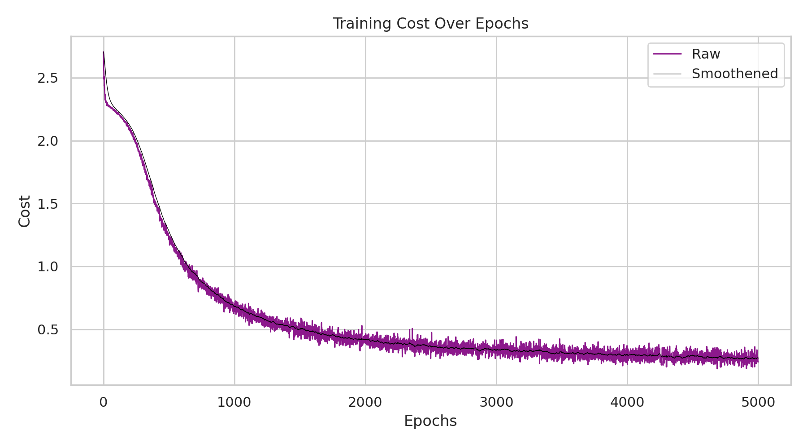

# 🕸️ Neural Network from Scratch (NumPy)

## About

This project implements a neural network from scratch using only NumPy
to classify handwritten digits from the MNIST dataset.

The focus is on understanding the internal mechanics of neural networks,
including forward propagation, backpropagation, and gradient-based optimization,
without relying on any machine learning frameworks.

## Results

### Accuracy over Epochs

The model’s accuracy improves steadily during training and begins to plateau,
indicating stable learning.

### Confusion Matrix

The majority of digits are classified correctly. Misclassifications tend to occur
between visually similar digits (e.g. between 4 & 9), suggesting that the model captures general
patterns well, while still struggling in some cases.

### Training Loss

The training loss decreases consistently over time, confirming that the model
is effectively learning through gradient-based optimization.

More visualizations and raw outputs are available in the [`results/`](results/) directory.

## Project Status

The core functionality is implemented, including:

- Neural network training
- MNIST data pipeline
- Weight saving and loading
- Visualization and result analysis

Currently improving:

- Code cleanup and refactoring

## Tech Stack

- Python
- NumPy
- Matplotlib
- Seaborn

## Notes

This project intentionally avoids high-level machine learning frameworks
to provide a deeper understanding of how neural networks operate internally.
